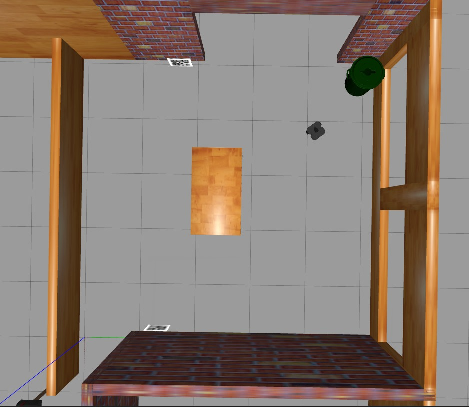
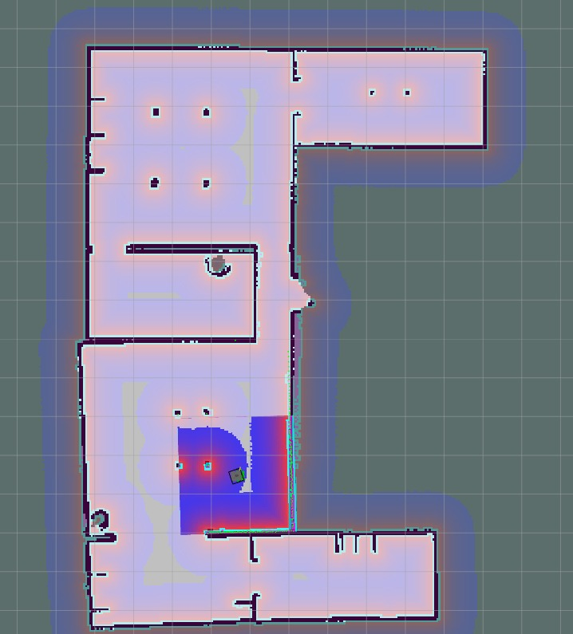
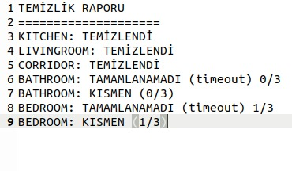
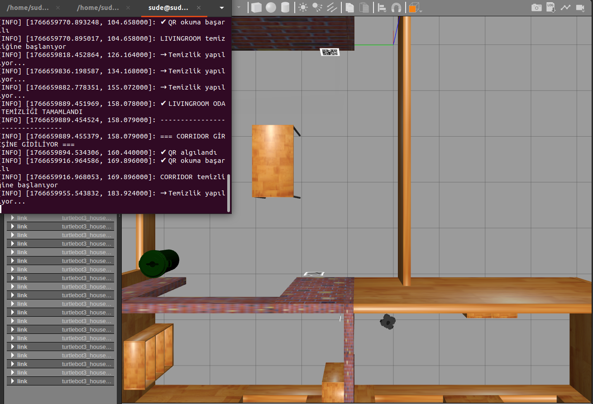

````markdown
# 🤖 KTUN Robotics – QR Tabanlı Otonom Temizlik Robotu 🧹

Bu proje, **ROS Noetic** ortamında çalışan,  
**QR kod ile oda doğrulaması**, **otonom navigasyon** ve  
**oda bazlı temizlik** gerçekleştiren akıllı bir mobil robot sistemidir.

Robot, ev ortamında odalara girerken QR kodları okuyarak hangi odaya girdiğini doğrular,  
her oda için belirlenen temizlik görevlerini yerine getirir ve  
tüm görevler tamamlandığında **detaylı bir temizlik raporu** oluşturur.

---

## 📌 Proje Özellikleri

- 📷 **QR Kod ile Oda Tanıma**
- 🔁 QR okuma için **2 deneme hakkı**
- 🔄 QR bulunamazsa **açı taraması (scan behavior)**
- ⏱️ Her oda için **timeout süresi**
- 🧭 `move_base` ile **otonom navigasyon**
- 🧹 **Oda bazlı temizlik görevleri**
- 📊 Görev sonunda **temizlik raporu**
- 🏠 Çok odalı ev senaryosu desteği
- 🧠 **YAML tabanlı görev yapılandırması**

---

## 🗂️ Proje Klasör Yapısı

```text
ktun_robotics/
├── launch/
│   └── start_my_project.launch
│
├── config/
│   └── mission.yaml
│
├── scripts/
│   └── qr_task.py
│
├── worlds/
│   └── my_house.world
│
├── maps/
│   ├── my_map.pgm
│   └── my_map.yaml
│
├── report/
│   └── temizlik_raporu.txt
│
├── images/
│   ├── gazebo.jpeg
│   ├── rviz.jpeg
│   ├── rapor.jpeg
│   └── terminal.png
│
├── README.md
├── package.xml
└── CMakeLists.txt
````

---

## ⚙️ Gereksinimler

* Ubuntu 20.04
* ROS Noetic
* Gazebo
* RViz
* OpenCV
* pyzbar
* move_base
* TurtleBot3 (Waffle_Pi)

---

## 🚀 Kurulum

Terminalde workspace’i kaynaklayın:

```bash
source ~/catkin_ws/devel/setup.bash
```

---

## ▶️ Çalıştırma Adımları

### 1️⃣ Gazebo Ortamını Başlatma

```bash
roslaunch ktun_robotics start_my_project.launch
```

---

### 2️⃣ Navigasyon Stack (AMCL + move_base)

```bash
roslaunch turtlebot3_navigation turtlebot3_navigation.launch \
map_file:=$HOME/catkin_ws/src/ktun_robotics/maps/my_map.yaml
```

---

### 3️⃣ Görev Yöneticisini Çalıştırma

```bash
rosrun ktun_robotics qr_task.py
```

> ⚠️ `qr+task.py` **kullanılmamalıdır**.
> Doğru dosya adı: **qr_task.py**

---

## 🧠 Görev Akışı

1. Robot ev ortamında başlar
2. Oda giriş waypoint’ine gider
3. QR kodu okumaya çalışır (**maksimum 2 deneme**)
4. QR bulunamazsa:

   * Robot bulunduğu yerde **açı taraması** yapar
   * Yine bulunamazsa oda **atlanır**
5. QR doğruysa:

   * Odaya ait temizlik noktalarına sırayla gider
6. Oda için belirlenen **timeout süresi aşılırsa**:

   * Oda başarısız sayılır
7. Tüm odalar tamamlanınca:

   * **Temizlik raporu oluşturulur**

---

## 🏷️ QR Kod Kuralları

QR içerikleri **aşağıdaki formatta olmalıdır**:

```
ROOM=LIVINGROOM
ROOM=BATHROOM
ROOM=KITCHEN
ROOM=BEDROOM
ROOM=CORRIDOR
```

* ❌ Yanlış QR → görev iptal edilir
* ⏳ QR 2 denemede okunamazsa → oda atlanır

---

## ⏱️ Timeout Mekanizması

* Her oda için **ayrı timeout süresi** vardır
* Süre aşılırsa:

  * O oda **TAMAMLANAMADI (timeout)** olarak işaretlenir
  * Robot bir sonraki odaya geçer

---

## 📄 mission.yaml Örneği

```yaml
rooms:
  - name: "LIVINGROOM"
    qr_expected: "ROOM=LIVINGROOM"
    entry_goal: {x: 1.5, y: -0.5, yaw: 0.0}
    cleaning_goals:
      - {x: 1.8, y: -1.0, yaw: 1.57}
      - {x: 2.2, y: -0.5, yaw: 0.0}
```

---

## 📊 Temizlik Raporu

Görev sonunda rapor:

* Terminalde gösterilir
* `report/temizlik_raporu.txt` dosyasına kaydedilir

### Örnek Çıktı

```
=== TEMİZLİK RAPORU ===
LIVINGROOM : TEMİZLENDİ
BATHROOM   : TEMİZLENDİ
KITCHEN    : TAMAMLANAMADI (timeout)
BEDROOM    : KISMEN (1/3)
CORRIDOR   : TEMİZLENDİ
=======================
```

---

## 🖼️ Görseller

### 🏠 Gazebo Ev Ortamı



### 🧭 RViz Navigasyon



### 📊 Temizlik Raporu



### 💻 Terminal Çıktıları



---

## 👩‍💻 Geliştirici

**Sude**
📍 Konya Teknik Üniversitesi
📘 Robotik & Yapay Zeka
📌 ROS • Python • OpenCV • Gazebo
